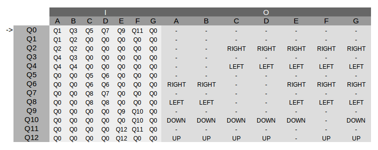

# kinect-processing-websocket
An easy way to use kinect power through websockets

##### Requirements
- Processing
- SimpleOpenNi
- NiTE
- a Kinect

To start open `server.pde` file in processing
```bash
mkdir myapp
cd myapp
git clone https://github.com/dsilva2401/kinect-processing-websocket.git .
[path/to/processing]/processing server/server.pde
```
And execute..

WebSocket will be available at `ws://domain:8080/p5websocket`

##### Sections


Available actions
- LEFT ( Arm from B to A or D to C  )
- RIGHT ( Arm from A to B or C to D  )
- UP (Arm from F to E)
- DOWN (Arm from E to F)

##### States chart
